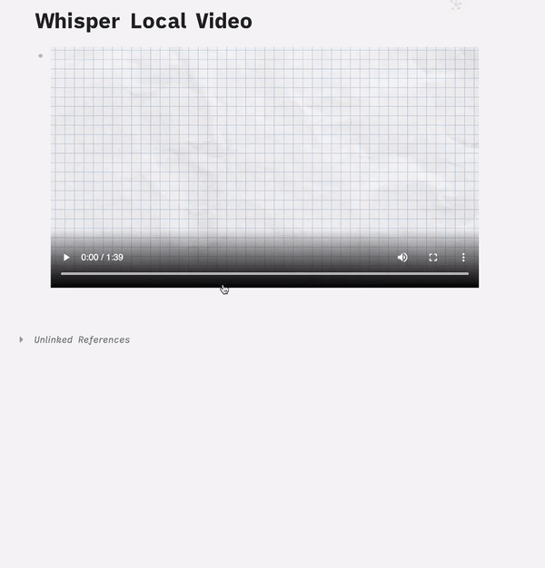
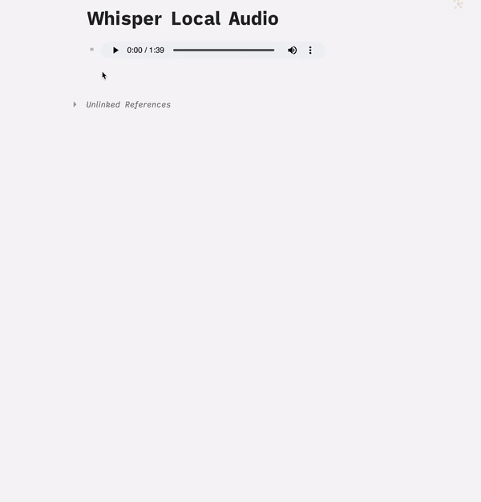

# logseq-plugin-whisper-subtitles
## Overview
* This plugin allows users to extract **subtitles with timestamp** from videos by interfacing with **[a local web server](https://github.com/usoonees/logseq-whisper-subtitles-server)** that running whisper service, **without calling OpenAI whisper API**.

* You can then view the extracted subtitles along with timestamps. 

* Currently, the plugin supports both YouTube videos and local video files. For the timestamp navigation functionality in local videos, an additional plugin [logseq-plugin-media-ts](https://github.com/sethyuan/logseq-plugin-media-ts) needs to be installed.

### Usage
* Ensure the [logseq-whisper-subtitles-server](https://github.com/usoonees/logseq-whisper-subtitles-server) is running locally.
* Change the endpoint settings in plugin settings if needed.
* If working with local videos and wish to utilize the timestamp navigation feature, ensure logseq-plugin-media-ts is installed.

### Demo
### Youtube Demo

### Local Video Demo

### Local Audio Demo

### Related Repository
* [logseq-whisper-subtitles-server](https://github.com/usoonees/logseq-whisper-subtitles-server) - The local web server running whisper, which is required to extract voice from videos and subsequently extract text from the voice.
* [logseq-plugin-whisper-subtitles](https://github.com/sethyuan/logseq-plugin-media-ts): A plugin generate timestamps for video, audio and Bilibili video, it takes you to the corresponding video/audio position when clicked.
* [whisper](https://github.com/openai/whisper): Robust Speech Recognition via Large-Scale Weak Supervision