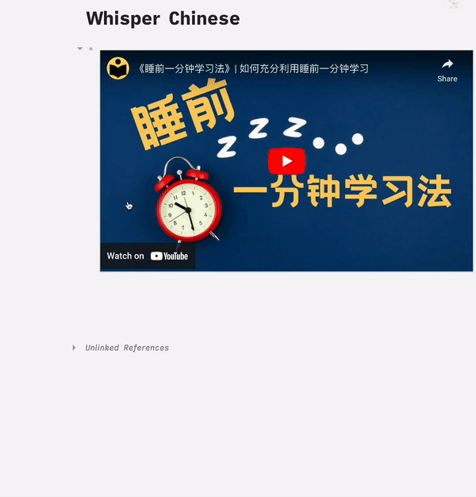

# logseq-plugin-whisper-subtitles

[English](https://github.com/usoonees/logseq-whisper-subtitles-server) | [日本語](https://github.com/usoonees/logseq-whisper-subtitles-server/blob/main/README.ja.md)

### Overview

* This plugin integrates with the processing server of "Whisper" running locally on the PC to transcribe text from videos like YouTube, providing **subtitles with timestamps**.
   > The entire process, from transcription by Whisper to importing the content into Logseq, is completed locally.

### Dependencies
* OpenAI Whisper API is not used. To make it work, you must run the dedicated server for this plugin, **[logseq-whisper-subtitles-server](https://github.com/usoonees/logseq-whisper-subtitles-server)**, every time. It receives data through this dedicated server (requests the local "Whisper" processing server).
* This plugin currently supports YouTube and local video files.
   > To use timestamp navigation for local video files, please install the [logseq-plugin-media-ts](https://github.com/sethyuan/logseq-plugin-media-ts) plugin.

### Usage

1. Install *Whisper subtitles* plugin from Logseq Marketplace.
   > The plugin settings include options for specifying Whisper model size, minimum segments, and endpoint.
1. Start the dedicated server for this plugin locally. Make sure it runs in the background.
1. Prepare a block with a video, such as a YouTube video.
   - For YouTube: Paste the URL into a block, and it will be embedded.
   - For local files: Copy and paste or drag them to embed as assets.
1. Right-click the bullet point (•) of that block and select "Transcribe (Whisper-Subtitles)" from the menu.
   > This will request the dedicated server to process it with Whisper. It may take a few minutes for Whisper to finish the transcription process. Once it's done, the block will have extracted timestamps and subtitles.

### Demo
#### YouTube Embedded in a Block

#### Video File Embedded in a Block (Local)

#### Audio Embedded in a Block (Local)

### Chinese Demo

### Related Repository
* [logseq-whisper-subtitles-server](https://github.com/usoonees/logseq-whisper-subtitles-server) - The local web server running whisper, which is required to extract voice from videos and subsequently extract text from the voice.
* [logseq-plugin-media-ts](https://github.com/sethyuan/logseq-plugin-media-ts): A plugin generate timestamps for video, audio and Bilibili video, it takes you to the corresponding video/audio position when clicked.
* [whisper](https://github.com/openai/whisper): Robust Speech Recognition via Large-Scale Weak Supervision